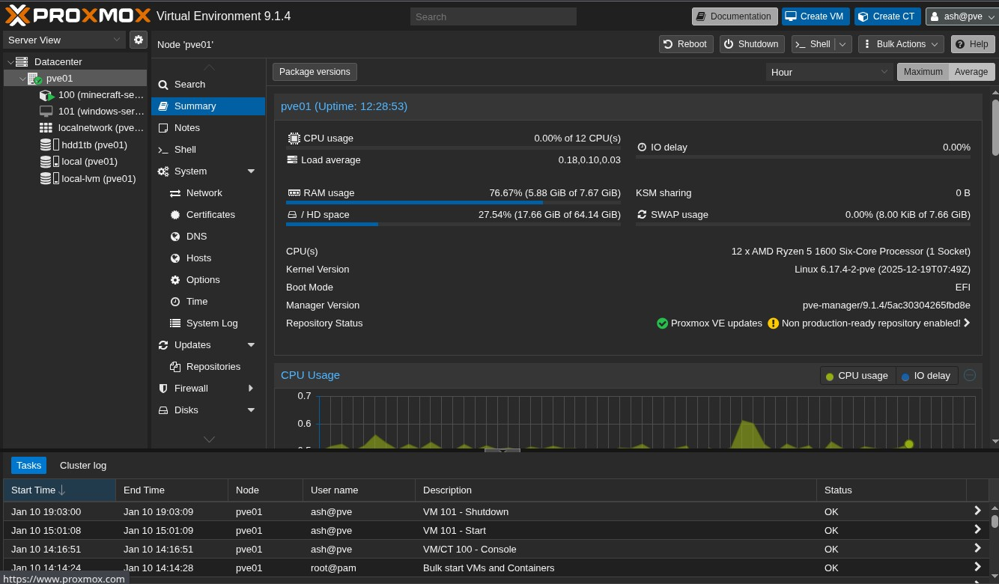
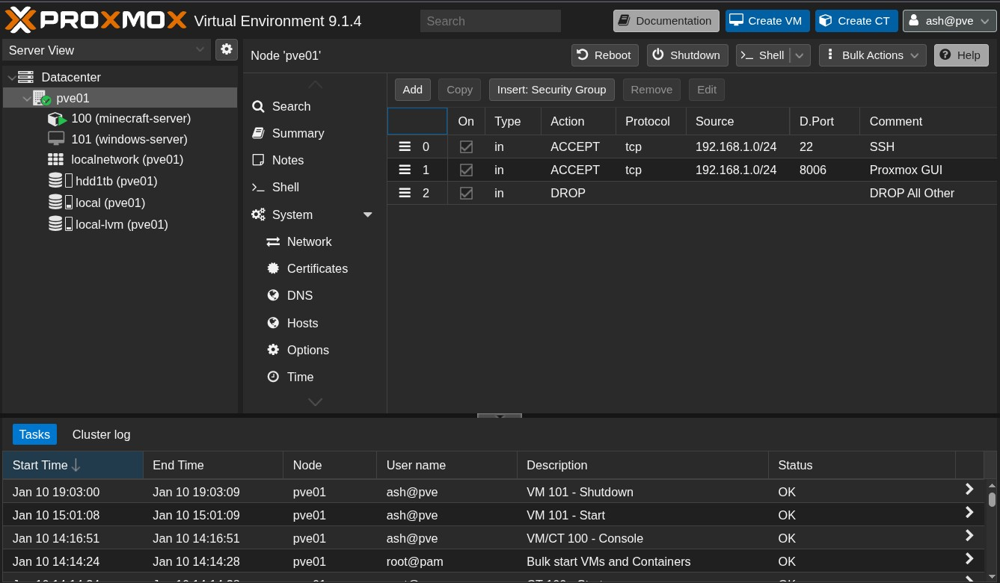
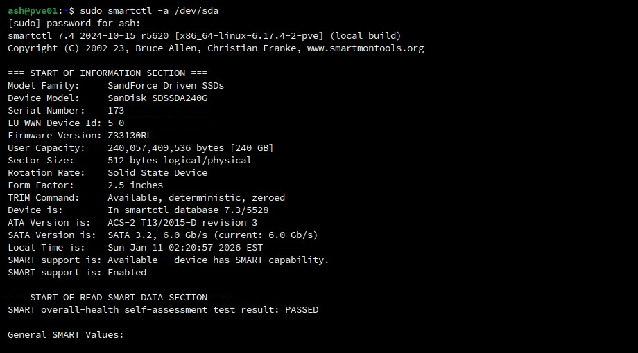
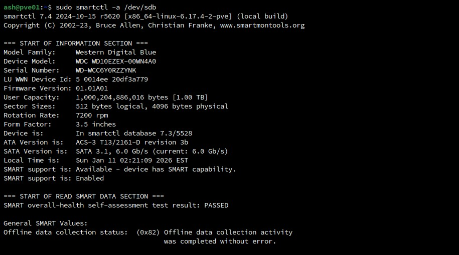
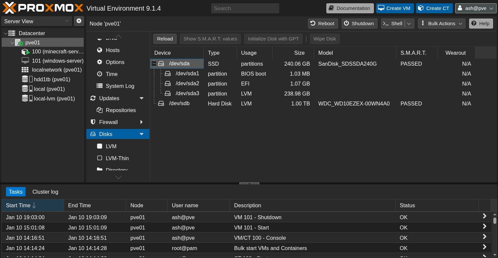
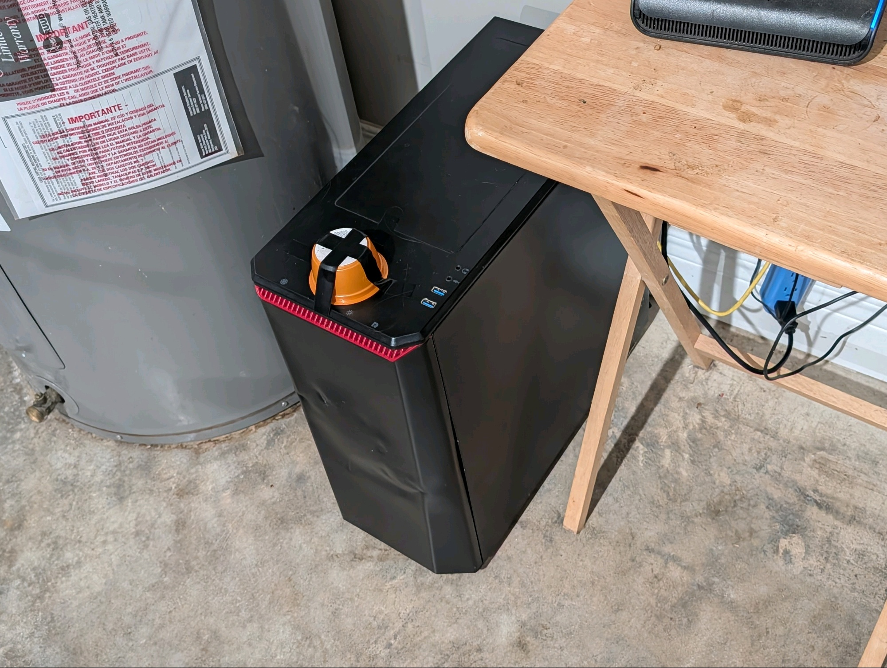

+++
author = 'Ashintosh'
title = 'Setting Up a Headless Proxmox Server: My Journey and Lessons Learned'
description = "Setting up a headless Proxmox server taught me networking, firewall, and security lessons. Here's how I tackled each challenge"
date = '2026-01-10T20:18:02-05:00'
lastmod = '2026-01-11T22:32:44-05:00'
draft = false
tags = [
    'Proxmox',
    'Home Lab',
    'Server Setup',
    'Networking',
    'IT Security',
    'Linux',
    'Virtualization',
    'Containers',
    'Network Troubleshooting',
    "SSH Security"
]
categories = ['Home Lab', 'Self-Hosting']
schemaType = 'BlogPost'
+++

## Introduction

One of my younger relatives asked if I could set up a private Minecraft server that everyone in the house could play on. I've run a few game servers in the past, so I figured it wouldn't be too difficult.

I had some older hardware collecting dust, an old gaming desktop with a Ryzen 5 1600 and 8GB of DDR4 RAM, which felt perfect for a small home lab server. My plan was to run Proxmox and keep the system completely headless, meaning no monitor or keyboard once everything was up and running.

That decision turned what should have been a straightforward setup into a surprisingly educational troubleshooting journey.

---

### 1. Initial Setup: Temporary Workspace, Permanent Problems

Since the server would eventually live in the garage, I started by setting everything up in a room where I had easy access to a monitor and keyboard.

Proxmox installed without issue. During installation, I initially configured a static IP address that I knew was available on my local network. Everything worked fine until I moved the system to the garage and connected it to the network for the first time.

Once connected there, the server never came online. It turned out my ISP-provided router didn't like devices using static IPs it hadn't handed out itself via DHCP.

So back to the workspace the server went.

I reconfigured the network interface to use DHCP and planned to reserve the IP address through the router instead. That's when I discovered my ISP had made things even more "user-friendly" by removing direct access to the router's configuration panel entirely. All configuration had to be done via their mobile app.

After fighting through account logins and limited options, I finally found the ability to reserve IP addresses. The router settings in the app were sparse but enough to move forward.


*Reserving an IP for the server through the ISP router app.*

---

### 2. Network Setup: IP Reservations and Remote Access Success

With DHCP enabled and an IP reservation set, I moved the server back into the garage.

Without a monitor, my only feedback came from refreshing the "connected devices" page in the router app until the NIC appeared. Once it did, I confirmed the IP reservation and tried accessing Proxmox via the web UI.

Success.

I also verified SSH access using the root credentials created during installation. At this point, the system was fully accessible remotely and ready to be hardened.

---

### 3. Securing the Server: Hardening Basics

Security is the first thing I address on any server, even ones that are only accessible on a local network.

Here's what I did:

- Created a non-root Linux user
- Configured SSH key-only authentication
- Created a non-root Proxmox UI user
- Enabled two-factor authentication for the Proxmox account
- Disabled default root login for the Proxmox UI
- Installed and configured fail2ban for SSH and the Proxmox UI
- Enabled Unattended Upgrades for automatic Debian security updates

Yes, this may be a bit overkill for a local-only server, but good habits scale, and bad ones come back to haunt you later.

---

### 4. Proxmox Firewall: Powerful, Opinionated, and Slightly Annoying

I normally manage firewalls directly through `iptables`, but I wanted to properly learn Proxmox's built-in firewall system. I was cautious here. I've locked myself out of servers before, and doing that to a headless machine in a garage wasn't appealing.

Proxmox firewall rules can be applied at multiple levels:

- Datacenter - applies to all nodes
- Node - applies to a specific host
- VM / CT - applies to individual guests

One thing I noticed quickly: Proxmox actively prevents you from locking yourself out of SSH or the web UI when connecting from the local network. Initially frustrating, but ultimately a good safeguard.

Another limitation: at the **Node** level, there's not GUI option to set a default DROP policy. Incoming traffic is accepted unless explicitly blocked.

To achieve the behavior I wanted, I configured sequential rules:

0. Allow SSH (22) connections from the local network
1. Allow Proxmox UI (8006) connections from the local network
2. Explicitly DROP all other traffic to those ports

Because Proxmox uses first-match rule evaluation, this achieved exactly what I wanted: local access allowed, everything else dropped.

Strictly speaking, this wasn't necessary since the server isn't exposed externally, but it was a great way to learn how Proxmox handles firewall rules.

---

### 5. Hardware Health: SMART Checks

This system was built with parts dating back to around 2016. Before trusting it with anything important, I ran SMART scans on both the SSD and HDD to check their health and wear levels.

This step is easy to skip, but losing data later because of a failing drive is far worse than replacing aging hardware early.

### SMART Scan Summary
#### SSD (SanDisk SDSSDA240G - 240 GB)

- **SMART overall-health**: PASSED
- **Power-On Hours**: 44,128 h
- **Power Cycles**: 1,403
- **Retired / Reallocated Blocks**: 0
- **Lifetime Writes / Reads**: 33,660 GiB written, 41,072 GiB read
- **Temperature**: 19 °C (min 0 °C / max 72 °C)
- **Other Notes**: No reported errors; short and extended self-tests completed successfully. No signs of wear-related failure.

**Summary:** Despite being over 7 years old, the SSD is healthy and reliable for home lab use.

#### HDD (Western Digital Blue WD10EZEX - 1 TB)

- **SMART overall-health**: PASSED
- **Power-On Hours**: 45,342 h
- **Power Cycles**: 1,797
- **Reallocated Sectors**: 0
- **Pending / Uncorrectable Sectors**: 0
- **Load / Start-Stop Cycles**: 36,191 / 1,797
- **Temperature**: 28 °C
- **Other Notes**: Extended self-tests completed successfully. No SMART errors reported.
  
**Summary:** Well-used but healthy; perfectly fine for non-critical storage with backups.

Overall, both drives are old but currently healthy. While neither would be ideal for critical or irreplaceable data, they are more than adequate for a home lab environment with proper backups in place.

---

### 6. Troubleshooting: The Real Pain Point

This is where things went sideways.

Despite everything appearing properly configured, the server would randomly lose network connectivity. When it happened:

- The router showed the device as disconnected
- The NIC link light was still blinking
- Remote access was impossible until a reboot

My first assumption was bad cabling. I replaced the initial CAT5 cable with a CAT6e cable, no improvement.

#### A False Lead: Network Drivers

After some research, I found a <a href="https://community.hetzner.com/tutorials/installing-the-r8168-driver?from_column=20423&from=20423" target="_blank">Hetzner community post</a> (<a href="https://web.archive.org/web/20260112033200/https://community.hetzner.com/tutorials/installing-the-r8168-driver?from_column=20423&from=20423" target="_blank">Archived</a>) discussing instability with the Realtek `r8169` driver, which my system was using. The symptoms of timeouts and link drops matched closely.

I compiled and installed the `r8168` driver from this <a href="https://github.com/mtorromeo/r8168" target="_blank">GitHub repository</a> (<a href="https://web.archive.org/web/20260112033218/https://github.com/mtorromeo/r8168" target="_blank">Archived</a>).

To avoid locking myself out when switching the network driver:

- I manually compiled and installed the new driver along side my current driver
- Blacklisted `r8169` to prevent it from being loaded
- Configured `r8168` to load on boot

Unfortunately, the problem persisted.

At this point, replacing the driver hadn't resolved the issue, indicating that the `r8169` driver itself wasn't the cause.

#### The Real Cause: Ryzen C-States

Then I remembered an issue I had years ago with first-generation Ryzen CPUs on Linux. Deep C-states could cause hard system locks.

To test the system headlessly, I plugged in a keyboard; when the next failure occurred, the Caps Lock LED didn't toggle when pressed, confirming that it was likely a hard lock and not a network or driver issue.

**The fix required a UEFI change:**

- Power Supply Idle Control -> Typical
- Global C-State Control -> Disabled

After applying these changes, the server has been running continuously for over a week without a single issue with stability.

I did try the GRUB workaround (`processor.max_cstate=1`), which did reduce the frequency of failures, but only the UEFI update fully resolved the issue.

---

### 7. Final Result

*After all the troubleshooting and UEFI tweaks, the server finally settled into its permanent home. It now sits proudly next to the hot water heater, on the concrete floor, sporting a few dents from past adventures, with a plastic cup taped over the power button to prevent curious fingers from accidentally shutting it down. Truly a fortress of solitude… and electrical tape.*

**After plenty of trial and error, I ended up with:**

- A stable, headless Proxmox server
- Secure access via SSH and web UI
- Reliable networking
- Hardware that I now trust
- A much better understanding of Proxmox, firewalls, and Ryzen quirks

---

## Lessons Learned

- **Test networking before going headless** -- make sure DHCP or static IPs work reliably.
- **ISP routers are limiting** -- consider your own router for more control.
- **Security habits matter, even locally** -- SSH keys, 2FA, firewalls, and fail2ban are worth it.
- **Proxmox firewall requires careful rule ordering** -- it's powerful but opinionated.
- **Not all "driver issues" are actually driver issues** -- hardware quirks can masquerade as software-level issues.
- **Document everything** -- your future self will thank you.
- **Headless setups demand diligence** -- always assume you'll need to recover without physical access.

By documenting this journey, I hope it saved someone else a few hours of frustration, or at least reassures them they're not alone when things don't work the first time.

If you have questions or want more details on any part of the setup, feel free to ask.